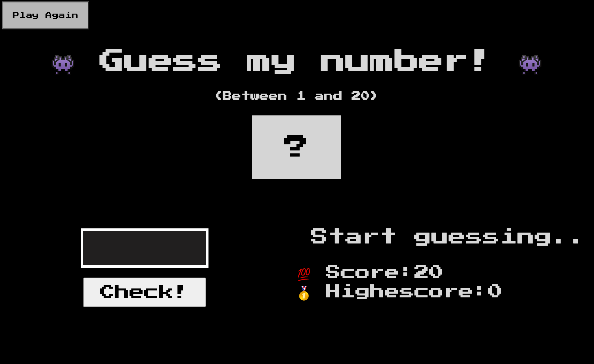
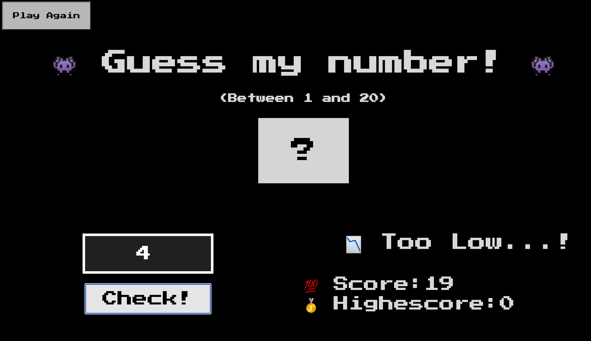
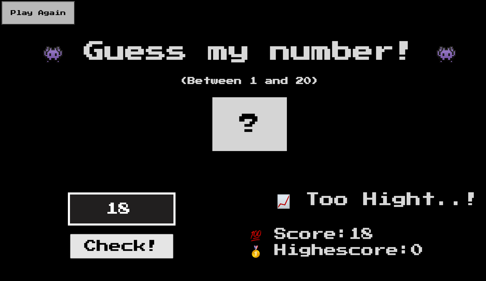
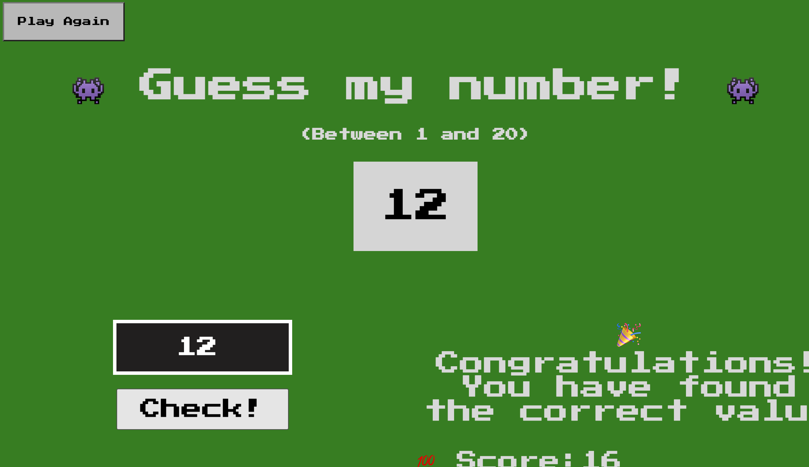
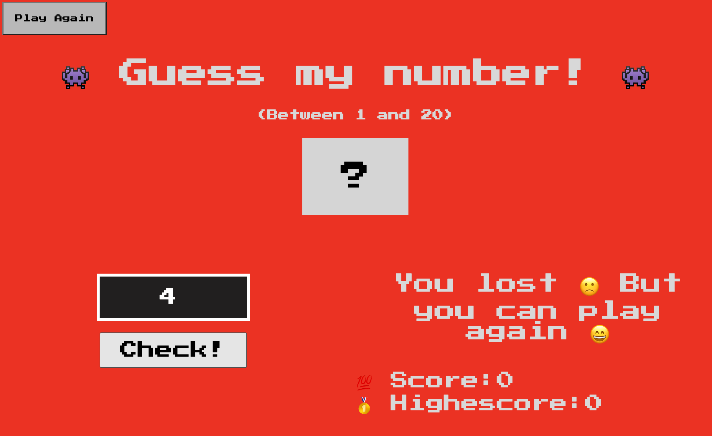
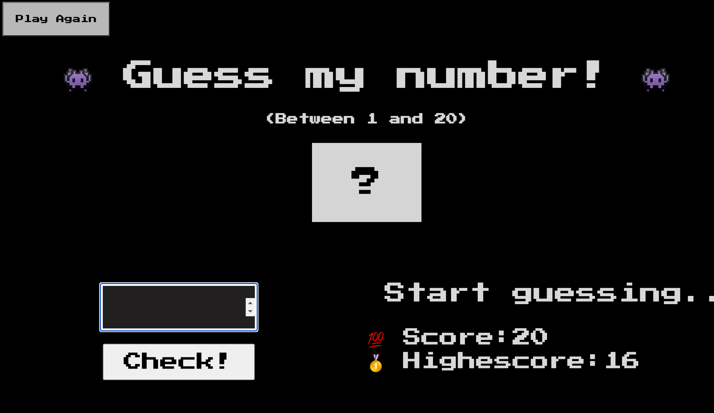
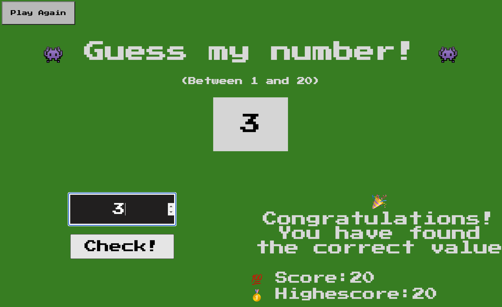

# Guess My Number Game

The "Guess My Number Game" is a small, simple web game (for practicing JavaScript) played by one player.

## How does it work

1. The application generate a random number between 1 and 20
   
2. Player asked to guess this number by inserting his
   gess in text box
3. Application will return if the value is correct, lower or higher then the correct value
   
   
4. Player wins if he guessed the correct value
   
5. Player loses if he didn't guess the number under then 20 attempt
   
6. User can play again by clicking the "Play again button"
   
7. Players can keep track of their best highscore
   
